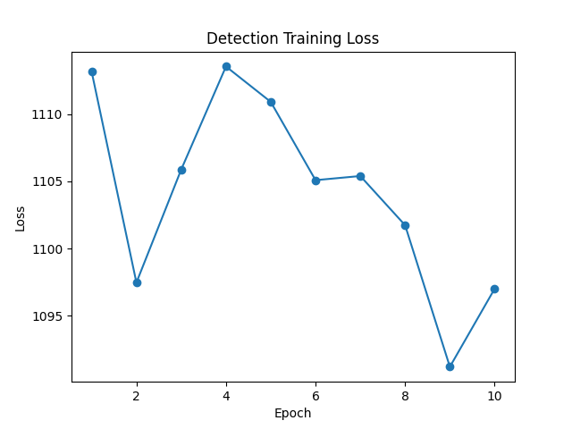

# 🩺 AI 기반 흉부 X-ray 폐렴 탐지 시스템 (ResNet18 & Faster R-CNN)


---

## 📌 프로젝트 개요
본 프로젝트는 심각한 **의료 인력 불균형**과 이로 인한 **진료 대기 장기화** 문제를 완화하기 위해 시작되었습니다.  
흉부 X-ray 영상 분석에 딥러닝을 적용하여 **폐렴을 조기 탐지**하고, 의료진에게 신속하고 정확한 보조 진단 정보를 제공하는 **AI 보조 진단 시스템** 구축을 목표로 합니다.

- **분류 (Classification, ResNet18)**: X-ray 이미지를 **정상/폐렴**으로 빠르게 초기 분류  
- **탐지 (Detection, Faster R-CNN)**: 폐렴 병변의 **정확한 위치 정보(Bounding Box)**를 제공하여 진단의 신뢰도를 높임  

---

## 🔄 연구 진행 과정 및 기술적 선택

| 단계 | 목표 | 주요 모델 | 결과 및 통찰 |
| :--- | :--- | :--- | :--- |
| **1. 초기 분류** | 신속한 환자 분류 | **ResNet18** | Accuracy 87% 달성. **폐렴 Recall 0.98**로 환자를 놓치지 않는 능력은 우수. |
| **2. 한계 인식** | 신뢰성 확보 | - | **정상 환자의 오분류 (False Positive)** 발생. 단순 분류만으로는 불필요한 추가 검사 및 의료 리소스 낭비. |
| **3. 탐지 모델 확장** | 실용적 보조 진단 | **Faster R-CNN** | Loss 감소 추세 확인 (6 Epoch). **병변 위치 시각화 가능**. Epoch 확장 시 성능 향상 기대. |


## 🗂️ 데이터셋
- Chest X-ray Pneumonia Dataset: [Kaggle](https://www.kaggle.com/datasets/paultimothymooney/chest-xray-pneumonia)  
- RSNA Pneumonia Detection Challenge: [Kaggle](https://www.kaggle.com/competitions/rsna-pneumonia-detection-challenge)  

---

## ⚙️ 환경 설정
```bash
# 1. 가상환경 생성 및 진입
python -m venv .venv

# Mac/Linux
source .venv/bin/activate

# Windows
.venv\Scripts\activate

# 2. 필수 패키지 설치
pip install -r requirements.txt
```

## 📂 프로젝트 구조

```text
project/
├── .venv/                      # 가상환경 (깃허브 업로드 시 제외 권장: .gitignore 처리)
├── checkpoint/                 # 모델 학습 중간 저장 가중치
├── chest_xray/                 # Classification용 데이터셋 (Kaggle Pneumonia)
├── dataset_det/                # Detection용 데이터셋 (RSNA Pneumonia)
├── pytorch_classification/     # Classification 관련 코드
│   ├── train_classification.py
│   ├── predict_classification.py
│   └── data_load.py
├── pytorch_detection/          # Detection 관련 코드
│   ├── train_detection.py
│   ├── predict_detection.py
│   └── rsna_dataset.py
├── pneumonia_resnet18.pth      # 학습 완료된 Classification 모델 가중치
├── requirements.txt            # 환경 패키지 목록
└── README.md                   # 프로젝트 설명 문서
```

## 🚀 실행 방법

### 1. Classification (ResNet18)

```bash
# 학습 실행
python train_classification.py

# 단일 이미지 추론
python predict_classification.py --image <image_path>
```

### 2. Detection (Faster R-CNN)

```bash
# 학습 실행
python train_detection.py

# 단일 이미지 추론
python predict_detection.py --image <image_path>
```
---

## 📊 결과 요약

### 🔹 Classification (ResNet18)
- **Accuracy**: 87%  
- **NORMAL** → Precision: 0.95 / Recall: 0.70 / F1-score: 0.80  
- **PNEUMONIA** → Precision: 0.84 / Recall: 0.98 / F1-score: 0.90  
- **한계**: False Positive 발생 → 의료 리소스 낭비 가능성  


## 📷 시각화 결과

### 🔹 Classification (ResNet18)
- Confusion Matrix  
    
- Grad-CAM (모델의 시각적 설명)  
    


### 🔹 Detection (Faster R-CNN)
- Loss Curve  
    
- Detection Example (X-ray 상 병변 탐지)  
    


## 🌍 참고자료
- Aidoc, “Radiology Solutions”: [Aidoc](http://aidoc.com/solutions/radiology)  
- Kaggle Datasets (Chest X-ray, RSNA Pneumonia Detection)  


